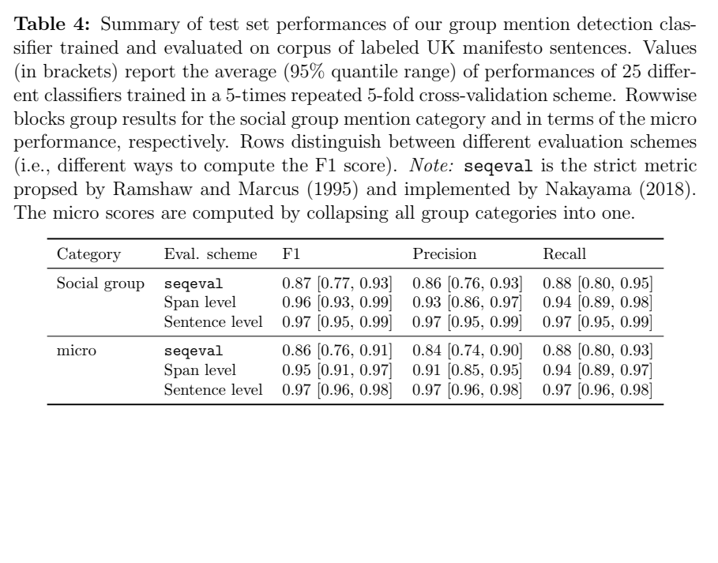
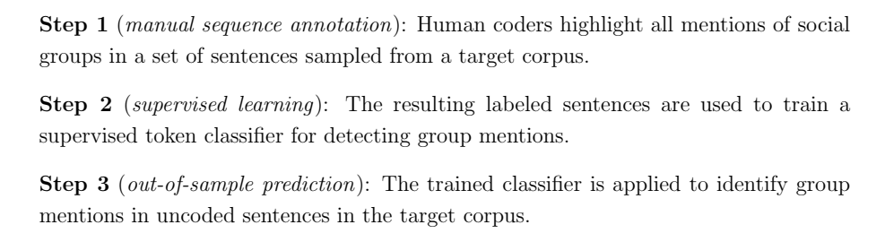
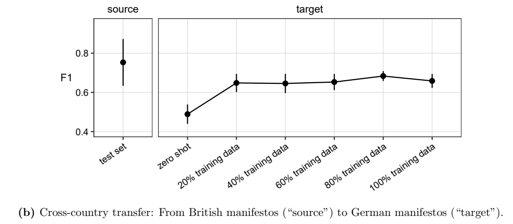

layout: true
    
<div class="logo"></div> 


```{r setup, include=FALSE}
# Here you can place global options for the entire document.
# Mostly used for knitr settings, but can also load data etc.
# Whatever happens here will not show in the presentation.
knitr::opts_chunk$set(fig.retina = 3, 
                      warning = FALSE, 
                      message = FALSE,
                      echo = F)


library(tidyverse)

source("../algo_ads/helpers.R")

overview <- readRDS("../algo_ads/data/overview.rds")

overview_day <- readRDS("../algo_ads/data/overview_day.rds")

# dir("../img", recursive = T, full.names = T) %>%
#   walk(~{file.copy(.x, str_remove(.x, "\\.\\.\\/"))})
```

---

class: center, white, middle


# So.. this is a **methods** paper


---

### What should a good methods paper include?

.pull-left[

<i>1.</i> Clearly defined research scope and relevance
+ What methodological gap does the study address?
+ Why is it important to measure/analyze what the study proposes?
{{content}}

]

--
    
<i>2.</i> Review and compare existing methods
+ Literature review
+ Empirical comparison of measures
+ What is the added value of proposed method?      
{{content}}

--

<i>3.</i> Detailed documentation of proposed method
+ Explanation of steps
+ Sampling/Annotation strategy
+ Code, including software packages used
+ Easiness to pick up for own use-case, potential pitfalls
{{content}}


---

### What should a good methods paper include?

.pull-left[

<i>1.</i> Clearly defined research scope and relevance
+ What methodological gap does the study address?
+ Why is it important to measure/analyze what the study proposes?


<i>2.</i> Review and compare existing methods
+ Literature review
+ Empirical comparison of measures
+ What is the added value of proposed method?   


<i>3.</i> Detailed documentation of proposed method
+ Explanation of steps
+ Sampling/Annotation strategy
+ Code, including software packages used
+ Easiness to pick up for own use-case, potential pitfalls


]


--

.pull-right[

<i>4.</i> Validation and Generalizability
+ How did the authors make sure their method does what they say it does?
+ Apply method on case study: 
    + appropriate case selection
    + cases need to be common and/or have potential for generalizability
{{content}}

  
]
  
--
    
<i>5.</i> Future research agenda(s)
+ What are the limitations of this method?
+ What research does this method enable?
{{content}}

---

### 1. Clearly defined research scope and relevance

+ **Relevance:** "study differences in [whether and] how politicians talk about social groups (e.g., refugees, women, the unemployed, ethnic minorities, etc.)"

+ **Problem:** "a lack of scalable measurement instruments [..] to identify group-based political rhetoric"

+ **Proposal:** The authors propose a **supervised machine learning classifier**
    + fine-tunes pre-trained transformer-based language models (RoBERTa) to identify mentions of (social) groups in political manifestos.
    
--

<br>


+ (Potential) research question(s): 
 
> 1. How can we identify and analyze group mentions in political texts using automated methods?

> 2. How does automated labeling compare to other (traditional) annotation methods (dictionaries/hand-coding)?


---

### 2. Review and compare existing methods

.pull-left[

The authors mainly compare their method to two others:

1. Hand-coded annotation
2. Dictionary (rule-based methods)

+ Results of supervised machine learning is impressive:




]

--

.pull-right[

+ No empirical comparison of how other methods would perform on the same dataset
    + is this even feasible though?

+ Any additional methods that should be compared or mentioned?
    + named entity recognition, unsupervised learning 
    
+ I am missing a bit of a more systematic comparison of the methods
    + Quality, Scalability, Required Skills


]


---

### 2. Review and compare existing methods

How to identify social group mentions in text and how methods compare:

| Method | Quality | Scalability | (Technical) Skill |
| --- | --- | --- | --- |
| Hand-coded annotation | High (if done correctly) | Low (time-consuming and labor-intensive) | Moderate to high (requires trained annotators) |
| Dictionary-based annotation | Moderate to low (depends on quality of dictionary) | High (relatively fast and easy to implement)  | Low to moderate (requires some technical knowledge but can be done with existing tools or software) |
| Supervised machine learning | High (if properly trained and validated)  | High (scalable to large text corpora)  | High (requires expertise in machine learning, natural language processing, and programming languages such as Python or R)|


---

### 3. Detailed documentation of proposed method

.pull-left[

- The paper provides a clear and concise presentation of the proposed method

<br>

- "Classical" supervised learning paradigm:



<br>

- The authors provide detailed explanations of how they trained their annotators to ensure consistency and accuracy

]


--

.pull-right[

+ Authors settle on using RoBERTa 
    + would there have been other options? would similar transformers perform as well?

+ So far code and software documentation is missing

    + If I want to implement this myself, how do I actually do this? 

]

---

### 4. Validation and Generalizability

.pull-left[
+ How did the authors make sure their method does what they say it does?
    + Cross-validation, out-of-sample predictions

+ Use Case application (UK and Germany):
    + application is rather descriptive
    + maybe: "Embedding Regression: Models for Context-Specific Description and Inference" (Rodriguez/Spirling 2022)

+ Testing cross-party and cross-country/language transfer
    + performance promising but enough?
    

    
]

--
    
.pull-right[

What about temporal aspect:

1. UK data goes from 1964-2019
    + language changes quite a lot in this time
2. Germany data goes from 2002-2021
    + "Menschen mit Migrationshintergund" instead of "Ausländer"
    + gendered languages changes: "Migrant*innen"

    
Question: if you have more recent data, how well can you predict into the past?
    
]


---

### 5.  Future research agenda(s)

.pull-left[

Authors discuss three limitations:

<i>1.</i> performance on other types of political texts such as parliamentary speeches, legislative documents, or social media posts is *unknown*

<br>

<i>2.</i> no *typology* of group mentions: e.g. "the working class" or "age-based group".

<br>

<i>3.</i> dependence on labeled data

]

--

.pull-right[

I would add a fourth one:

<i>4.</i> necessitates a computational skillset and likely fluency in R/Python


+ What analysis are enabled/enhanced through this method?
    + this could be a bit stronger in the conclusion

]

---

# Additional Questions

1. Computational resources: how long does it take to train the model(s)?


2. You mention that you also train on political groups, institutions, implicit social groups, collective actors. What are the proportions of these? 

---

class: center, middle

# Congratulations to an excellent and informative paper :)


.pull-left[


]

.pull-right[


]


