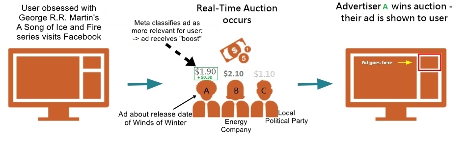
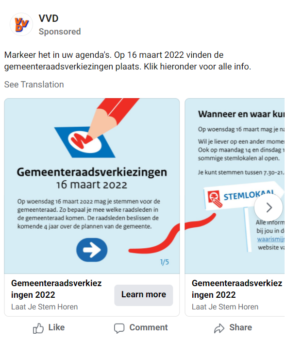
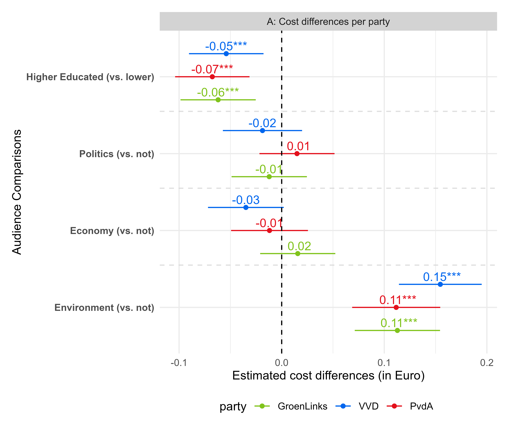

layout: true
    
<div class="logo"></div> 
 
 

```{r setup, include=FALSE}
# Here you can place global options for the entire document.
# Mostly used for knitr settings, but can also load data etc.
# Whatever happens here will not show in the presentation.
knitr::opts_chunk$set(fig.retina = 3, 
                      warning = FALSE, 
                      message = FALSE,
                      echo = F)


library(tidyverse)

source("../algo_ads/helpers.R")

overview <- readRDS("../algo_ads/data/overview.rds")

overview_day <- readRDS("../algo_ads/data/overview_day.rds")

# dir("../img", recursive = T, full.names = T) %>%
#   walk(~{file.copy(.x, str_remove(.x, "\\.\\.\\/"))})
```


---

### Political Microtargeting

+ Discourse on (online) political microtargeting is often focused on the "bad actor" story

  + Russian election interference campaign (IRA)
  
  + Cambridge Analytica
  
--

<br>

+ The explicit assumption here is that the advertisers have strong control over who sees which ad

> But there is more than just targeting criteria that decides who sees political ads:

   + advertisers can set targeting *boundaries*

   + *ad auctions* and *ad delivery algorithms* decide which individual users get ads from which advertiser


---

### Who decides who sees which ad on Meta?


+ **Ad auctions** = an auction takes place that determines which ad by whom is shown: based on *budget*


---

### Who decides who sees which ad on Meta?


+ **Ad auctions** = an auction takes place that determines which ad by whom is shown: based on *budget*

+ **Relevance** = how relevant is the ad to the user

```{r, out.width="70%", echo = F}
knitr::include_graphics("img/relevant_quote.png")
```

[(Meta Business Help Center, 2022)](https://www.facebook.com/business/help/430291176997542)

---

### Who decides who sees which ad on Meta?


+ **Ad auctions** = an auction takes place that determines which ad by whom is shown: based on *budget*

+ **Relevance** = how relevant is the ad to the user




#### The process of finding *relevant* audiences is done by *ad delivery algorithms*: 

#### **algorithmic microtargeting**

---


### Who decides who sees which ad on Meta?


When targeting the same audience, at the same time, with the same budget:

+ Ad delivery is heavily skewed along gendered and racial stereotypes
  + even without the intent of the advertiser [(Ali et al., 2020)](https://dl.acm.org/doi/10.1145/3359301)

--

Regarding political ads [(Ali et al., 2021)](https://dl.acm.org/doi/pdf/10.1145/3437963.3441801):

--

+ **Skewed delivery**

  + Political ads more often delivered to ideologically congruent audience 
      + Bernie ads → higher % D; 
      + Trump ads → higher % R

--

+ **Increased cost**

  + Liberal ad to a liberal audience: *21 Dollar per 1000 users*; 
  + Conservative ad delivered to liberal audience: *40 Dollar per 1000 users*.

---

class: center, middle

## Research Question

### How does the Meta ad delivery algorithm<br>influence the pricing & distribution of political ads<br>in the Netherlands?

---

class: center, middle

# Research Design

---

### Research Design

+ Algorithm audit study

+ Place the same ads targeting the same audiences (9 different ones)

--

+ Collaborate with Dutch parties to place political ads

+ Final collaboration with 3: 

  1. GroenLinks (Green party)
  2. VVD (centre-right party of PM Rutte)
  3. PvdA (social democrats)
  

--

+ Place ads before nationwide local elections on March 16th 2022
  + 1st to 7th February 2022

+ Spend 2 Euros a day on 45 ad copies

  + in total: 630 Euro per party
  
+ Pre-registered research design and hypotheses [(osf.io/xmc7g)](osf.io/xmc7g)

---

### Hypotheses


[(Meta Business Help Center, 2022)](https://www.facebook.com/business/help/430291176997542)


> **H1:** **The more relevant** an audience is for an ad, **the cheaper is the cost** for reaching 1000 users in that audience.

> **H2:** **The more relevant** an audience is for an ad, **the more are ads delivered** to that audience.

--

We expect that ads by party with a greater share of supporters are less expensive (H3a) and reach more people (H3b)

> **H3a:** Parties with a greater share of supporters pay less for reaching 1000 users.

> **H3b:** Parties with a greater share of supporters reach more people than smaller parties.


---


### Targeting criteria


We used 9 different (paired) targeting criteria for our advertisements

.pull-left[

1. Political interests
2. Excluding political interest

<ol start="3">
  <li>Higher educated audience</li>
  <li>Lower educated audience</li>
</ol>

<ol start="5">
  <li>Environmental interests</li>
  <li>Excluding environmental interests</li>
</ol>

<ol start="7">
  <li>Economic interests</li>
  <li>Excluding Economic interests</li>
</ol>
  
<ol start="9">
  <li>No Targeting</li>
</ol>

]


---

## How the ad looked like on Desktop


<p style="clear: both;">


---

## How the ad looked like on Desktop





---

class: center, middle

## Results

$\rightarrow$ all results are controlled for engagement (clicks and likes parties received)

---

class: center, white, middle

### Between-party differences

$\rightarrow$ we consistently find one party that pays less and reaches more people 


---

class: white

#### Between-party differences (per individual ad)

.font80[PvdA pays the least (**10-12 cents less per ad** or: 8-10%) & reaches more people (~**1.1 - 1.3k more per ad**).<br>In total: PvdA reaches **14-17k more unique people for same price**]


.pull-left[


```{r, echo=F}

share_dat <- overview %>% 
  drop_na(ad_name) %>%
  # set_names(names(overview_uva)) %>% 
  mutate(pair = readr::parse_number(ad_set_name)) %>% 
  mutate(comparison = case_when(
    str_detect(ad_name, "Economy") ~ "Economy",
    str_detect(ad_name, "Environment") ~ "Environment",
    str_detect(ad_name, "Education") ~ "Education",
    str_detect(ad_name, "Politics") ~ "Politics",
    T ~ NA_character_
  )) %>% 
  drop_na(comparison) %>% 
  # count(ad_name)
  group_by(pair, comparison, party) %>% 
  mutate(total = sum(reach),
         share = reach/total*100) %>% 
  ungroup()

overview %>% #filter(is.na(targeting))
  drop_na(targeting) %>% 
  # filter(targeting == "No Targeting") %>%
  mutate(party = fct_relevel(party, c("PvdA", "GroenLinks", "VVD"))) %>% 
  ggplot(aes(party, cost_per_1_000_people_reached)) + # Move y and x here so than they can be used in stat_*
  geom_jitter(width = 0.2) +
  geom_boxplot(aes(color = party), width = 0.2) +
  # stat_summary(aes(color = party), fun = mean, fun.min = mean, fun.max = mean,
  #              geom = "crossbar", width = 0.5) +
  scale_color_parties() +
  theme_minimal() +
  theme(legend.position = "none", plot.title = element_text(size = 19, face = "bold")) +
  # ggpubr::stat_compare_means() +
  EnvStats::stat_mean_sd_text(digits = 2) +
  labs(y = "Cost per 1000 users reached\nin Euros (across all conditions)", x = "Party", title = "Cost per 1000 users per ad\n") 

share_dat %>% 
    filter(str_detect(targeting, "Higher")) %>% 
    arrange(-share) %>% 
    select(party, reach, share, targeting, relevance)
```


]

--

.pull-right[


```{r, echo=F}


overview %>% 
  drop_na(targeting) %>% 
  # filter(targeting == "No Targeting") %>%
  mutate(party = fct_relevel(party, c("PvdA", "GroenLinks", "VVD"))) %>% 
  ggplot(aes(party, reach)) + # Move y and x here so than they can be used in stat_*
  geom_jitter(width = 0.2) +
  geom_boxplot(aes(color = party), width = 0.2) +
  # stat_summary(aes(color = party), fun = mean, fun.min = mean, fun.max = mean,
  #              geom = "crossbar", width = 0.5) +
  scale_color_parties() +
  theme_minimal() +
  theme(legend.position = "none", plot.title = element_text(size = 19, face = "bold")) +
  # ggpubr::stat_compare_means() +
  EnvStats::stat_mean_sd_text(digits = 0) +
  labs(y = "Reach (across all conditions) per ad", x = "Party", title = "Reach (unique people)\n") 
```


]


---


class: white

#### Between-party differences (per target audience)

--

<!--  -->


---


class: white
#### Between-party differences (zoomed in)

.font80[*Exclude economic interests* or *target environmental interests*:<br>VVD reaches fewer people per ad than GL (**~380-450 fewer people**) and pay more (**4-5 cents more**)]


.pull-left[
```{r}

mod_nobreak_h1cg <- lm(reach ~ targeting * party + engagement, data = overview)

library(modelbased)

contrasts_nobreak_h1cg <- estimate_contrasts(mod_nobreak_h1cg, contrast = c("targeting", "party"),
                                at = c("targeting", "party")) %>% 
  as.data.frame()  %>%  
  mutate(Contrast = paste(Level1, "-", Level2)) %>%  
  mutate(condition_comparison = fct_reorder(Contrast, Difference)) 


ww <- contrasts_nobreak_h1cg %>% 
  filter(str_detect(condition_comparison, "excluded")) %>% 
  filter(str_count(condition_comparison, "Economy excluded") == 2)  %>% 
  mutate(party = str_extract(Level1, "VVD|GroenLinks|PvdA")) %>% 
  filter(str_detect(Level2, "GroenLinks")) %>% 
  bind_rows(contrasts_nobreak_h1cg %>%
  filter(!str_detect(condition_comparison, "excluded")) %>%
  filter(str_count(condition_comparison, "Environment") == 2)  %>%
  mutate(party = str_extract(Level1, "VVD|GroenLinks|PvdA")) %>%
  filter(str_detect(Level2, "GroenLinks"))) %>%
  # bind_rows(contrasts_nobreak_h1cg %>% 
  # filter(!str_detect(condition_comparison, "excluded")) %>%
  # filter(str_count(condition_comparison, "Economy") == 2)  %>% 
  # mutate(party = str_extract(Level1, "VVD|GroenLinks|PvdA")) %>% 
  # filter(str_detect(Level2, "GroenLinks"))) %>% 
  # bind_rows(contrasts_nobreak_h1cg %>% 
  # filter(!str_detect(condition_comparison, "excluded")) %>%
  # filter(str_count(condition_comparison, "Politics") == 2)  %>% 
  # mutate(party = str_extract(Level1, "VVD|GroenLinks|PvdA")) %>% 
  # filter(str_detect(Level2, "GroenLinks"))) %>% 
  # in case the comparison is in wrong direction, change around
  # mutate_at(vars(Difference, CI_low, CI_high), ~ifelse(str_detect(condition_comparison, "excluded"), .x*-1, .x)) %>%
  # mutate_at(vars(Difference, CI_low, CI_high), ~ifelse(str_count(condition_comparison, "VVD")==2, .x*-1, .x)) %>%
  # mutate_at(vars(Difference, CI_low, CI_high), ~ifelse(str_detect(Level1, "Low"), .x*-1, .x)) %>%
  mutate(condition_comparison = str_remove_all(condition_comparison, "VVD|GroenLinks|PvdA")) %>% 
  mutate(plabel = get_plabs(p)) %>% 
  mutate(diff_label = paste0(round(Difference, 2), plabel)) 
  # count(condition_comparison)
  # mutate(condition_comparison = "Reach of audience interested in the Environment (compared to VVD and Environment excluded)") %>% 
  # mutate(condition_comparison = ifelse(
    # !str_detect(condition_comparison, "excluded"),
    # "Reach of audience interested in the Environment (compared to GroenLinks)",
    # "Reach of audience interested in the Environment (compared to Environment excluded)"
    # )) 
# -> ww

ww %>% 
    ggplot(aes("", Difference, color = party)) + 
    geom_point(position = position_dodge(width = 0.9)) +
    geom_errorbar(aes(ymin = CI_low, ymax = CI_high), width = 0, position = position_dodge(width = 0.9)) +
    geom_text(aes(label = diff_label, x= 0 %>% magrittr::add(1.15), y = Difference), position = position_dodge(width = 0.9), show.legend = F) +
    coord_flip() +
    geom_hline(yintercept = 0, linetype = "dashed") +
  labs(y = "Estimated reach differences",
         x = "Targeting Comparisons") +
    theme_minimal() +
    scale_color_parties() +
    ggtitle("Reach (compared to GroenLinks)") +
    # facet_grid(condition_comparison ~ ., scales= "free_y" ) +
    facet_wrap(~condition_comparison, ncol = 2, scales= "free_y" ) +
    theme(legend.position = "bottom",
          strip.text.y = element_blank(), 
          strip.background = element_rect(fill = "lightgrey")) 


```
]

```{r,eval=F}
overview %>% 
    filter(targeting == "Economy excluded") %>% 
    group_by(party) %>% 
    summarise(reach = max(reach))

overview %>% 
    filter(targeting == "Environment") %>% 
    group_by(party) %>% 
    summarise(reach = max(reach))
```


.pull-right[

```{r}
mod_nobreak_h1cg <- lm(cost_per_result ~ targeting * party + engagement, data = overview)

```

```{r}
library(modelbased)

contrasts_nobreak_h1cg <- estimate_contrasts(mod_nobreak_h1cg, contrast = c("targeting", "party"),
                                at = c("targeting", "party")) %>% 
  as.data.frame()  %>%  
  mutate(Contrast = paste(Level1, "-", Level2)) %>%  
  mutate(condition_comparison = fct_reorder(Contrast, Difference)) 


ww <- contrasts_nobreak_h1cg %>% 
  filter(str_detect(condition_comparison, "excluded")) %>% 
  filter(str_count(condition_comparison, "Economy excluded") == 2)  %>% 
  mutate(party = str_extract(Level1, "VVD|GroenLinks|PvdA")) %>% 
  filter(str_detect(Level2, "GroenLinks")) %>% 
  bind_rows(contrasts_nobreak_h1cg %>%
  filter(!str_detect(condition_comparison, "excluded")) %>%
  filter(str_count(condition_comparison, "Environment") == 2)  %>%
  mutate(party = str_extract(Level1, "VVD|GroenLinks|PvdA")) %>%
  filter(str_detect(Level2, "GroenLinks"))) %>%
  # in case the comparison is in wrong direction, change around
  # mutate_at(vars(Difference, CI_low, CI_high), ~ifelse(str_detect(condition_comparison, "excluded"), .x*-1, .x)) %>%
  # mutate_at(vars(Difference, CI_low, CI_high), ~ifelse(str_count(condition_comparison, "VVD")==2, .x*-1, .x)) %>%
  # mutate_at(vars(Difference, CI_low, CI_high), ~ifelse(str_detect(Level1, "Low"), .x*-1, .x)) %>%
  mutate(condition_comparison = str_remove_all(condition_comparison, "VVD|GroenLinks|PvdA")) %>% 
  mutate(plabel = get_plabs(p)) %>% 
  mutate(diff_label = paste0(round(Difference, 2), plabel)) 
  # count(condition_comparison)
  # mutate(condition_comparison = "Reach of audience interested in the Environment (compared to VVD and Environment excluded)") %>% 
  # mutate(condition_comparison = ifelse(
    # !str_detect(condition_comparison, "excluded"),
    # "Reach of audience interested in the Environment (compared to GroenLinks)",
    # "Reach of audience interested in the Environment (compared to Environment excluded)"
    # )) 
# -> ww

ww %>% 
    ggplot(aes("", Difference, color = party)) + 
    geom_point(position = position_dodge(width = 0.9)) +
    geom_errorbar(aes(ymin = CI_low, ymax = CI_high), width = 0, position = position_dodge(width = 0.9)) +
    geom_text(aes(label = diff_label, x= 0 %>% magrittr::add(1.15), y = Difference), position = position_dodge(width = 0.9), show.legend = F) +
    coord_flip() +
    geom_hline(yintercept = 0, linetype = "dashed") +
  labs(y = "Estimated cost differences",
         x = "Targeting Comparisons") +
    theme_minimal() +
    scale_color_parties() +
    ggtitle("Cost (compared to GroenLinks)") +
    # facet_grid(condition_comparison ~ ., scales= "free_y" ) +
    facet_wrap(~condition_comparison, ncol = 2, scales= "free_y" ) +
    theme(legend.position = "bottom",
          strip.text.y = element_blank(), 
          strip.background = element_rect(fill = "lightgrey")) 

```


]

---


class: center, white, middle

### Within-party differences

---

class: white

### Within-party differences - Price per 1k


.pull-left[


For everyone:

Ads **cost less for**:

+ *higher-educated* vs. *lower-educated audience*

Ad price **does not statistically differ for**:

+ Audience *interested in the economy* vs. *not interested*

+ Audience *interested in politics* vs. *not interested*

Ads **cost more for**:

+ Audience *interested in the environment* vs. *not interested*

(also true for GroenLinks)


]

.pull-right[



]

---

class: center, middle

## Summary


---

### Summary

Our findings do not always align with expectations.

--

**However:**

> We find that Meta ad delivery algorithm prioritizes certain parties and audiences for political advertising


There are also *age, gender and regional biases*

Even after controlling for Meta user breakdown:

+ Men systematically receive more ads than women 

+ 18-24 year olds systematically receive less ads 

+ Certain Dutch provinces systematically receive less ads than others 

---


### Implications


+ Meta (dis-)advantages certain parties

  +  political parties were not charged the same price for the same service
  
  + Unequal playing field

--

+ Some groups of people and regions are **systematically** less likely to receive political advertisements and more expensive to reach

  + isolating these groups from receiving election-related information
  
  + may deepen political, social and geographical inequalities

--

+ No transparency by Meta about these systematic biases

  + difficult to research and make visible instances of unequal treatment and price discrimination
  + highlighting importance of access to data
  
--
  
+ Simply "banning" microtargeting would be inadequate

  + more power to the black box algorithm
  
---

class: center, middle

## Thank you for your attention!


